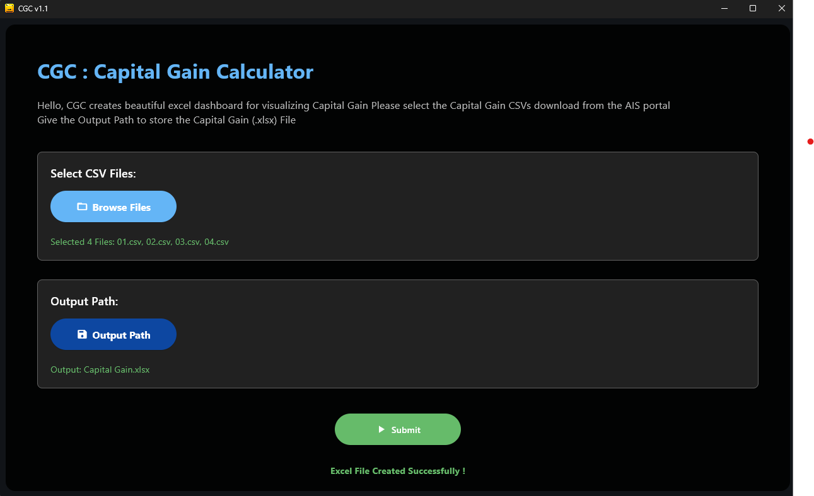
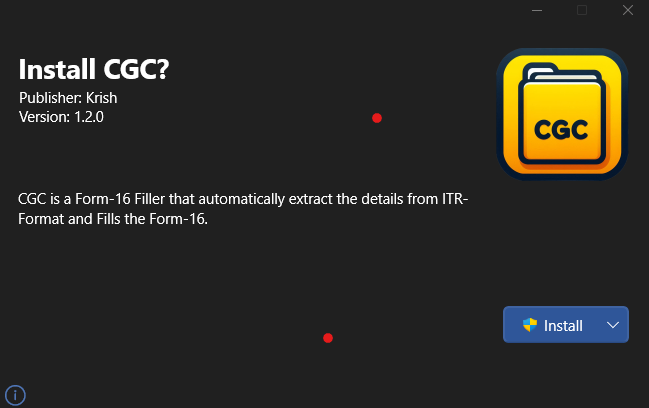

# CGC - *Capital Gain Calculator* 📈

## Overview 🕶️

**CGC** is a capital gain visualizer designed to automate the calculation of **stock market trades**. It simplifies the process of tax computation on capital gains using data extracted from **AIS Trade Data**, and generates a `Capital Gain.xlsx` file for easy visualization and tax planning.

To use CGC, you need to download your **Trade Data** from the [E-Filing Portal](https://eportal.incometax.gov.in/).

> ⚠️ **Note:**
> This software is developed for **Pooja ITR Centre**. It is publicly available for general use, but proprietary Excel sheets like `ITR-Format` and `Form-16` are kept private and are not distributed with this software or any other tools sponsored by **Pooja ITR Centre**.

---

## ✨ Features

* Extracts trade details from multiple **CSV files** downloaded from [E-Filing Portal](https://eportal.incometax.gov.in/)
* Generates a `Capital Gain.xlsx` dashboard for tax & trade insights
* Clean, user-friendly interface
* Modern UI built using [Flet](https://flet.dev)
* Can be compiled as a **web app**, **desktop app**, or even an **Android APK**

---

## 🖼️ Interface Preview

### Application UI



### Installer

A sleek modern installer provides a rich installation experience.


---

## ⬇️ Installation

Download the latest release from the Release of this repository.

---

## ⚙️ Building from Source (Windows)

Make sure `git` is installed on your system. Verify with:

```bash
git -v
```

Then clone and build:

```powershell
git clone --no-checkout https://github.com/Krishna-Noutiyal/ITR-Kit.git
cd ITR-Kit
git sparse-checkout init
git sparse-checkout set capital_gain_calculator
git checkout main
cd capital_gain_calculator
.\build.ps1 -i
```

> This script installs all required packages and builds the app. The final output will be inside the `build/windows` directory.

---

## 🛠️ Usage

1. Download **Trade CSV files** from the [E-Filing Portal](https://eportal.incometax.gov.in/)
2. Launch the CGC application
3. Select the downloaded **CSV files**
4. Choose the output folder
5. Click *Submit* – your `Capital Gain.xlsx` dashboard will be generated automatically!

---

## 📂 File Structure

```text
capital_gain_calculator/
├── assets/              # Icons and branding assets
├── config/              # Theme & color configuration
├── dashboards/          # Visualization dashboards for trades
├── icons/               # Build-time icons
├── routes/              # App routing logic
├── scripts/             # Internal utility scripts
├── ui/                  # User interface components
├── main.py              # Application entry point
├── build.ps1            # Build and setup script
├── myproject.toml       # Project configuration
├── requirements.txt     # Python dependencies
└── README.md            # You are here!
```

---

## 📦 Dependencies

Make sure the following Python packages are installed:

* `Python 3.9+`
* `flet`
* `xlsxwriter`
* `pandas`
* `toml`

You can install all dependencies using:

```bash
pip install -r requirements.txt
```

---

## 💰 Sponsorship & Licensing

This project is fully sponsored by **Pooja ITR Centre**, which provides funding and maintains rights over proprietary data formats. Although CGC is public, certain Excel templates remain private and are not bundled in this repository.

---

Let me know if you’d like me to:

* Add license info
* Include contribution guidelines
* Add shields/badges (build status, python version, etc.)
* Optimize it for PyPI or packaging

I'm here to help!
