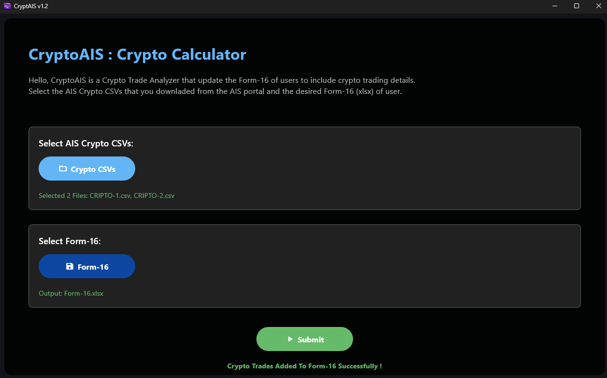

# CryptoAIS - *Crypto Trade Calculator* 🧮

## Overview 🕶️

**CryptoAIS** is a lightweight and powerful tool designed to automate **capital gain calculations on cryptocurrency trades**. It extracts trade data from **AIS Crypto CSVs** (downloaded from the [E-Filing Portal](https://eportal.incometax.gov.in/)) and directly fills the required details into your **Form-16 Excel template**.

This eliminates the need for manual entry and speeds up the filing process, especially for crypto traders who need to reflect their gains accurately in income tax filings.

> [!WARNING]
The software is created for **Pooja ITR Centre**, and is publicly available for use, but the Excel sheets like ITR-Format and Form-16 are kept private. Therefore, these sheets are not shared with this or any other software.

---

## Interface Preview 🖥️

### App UI

The clean, modern interface makes the entire process simple and intuitive:



### Installer

Includes a modern installer for smooth setup:


---

## Features ✨

* Reads **crypto trade data** from AIS CSVs
* Automatically fills in **Form-16 Excel template**
* Eliminates manual data entry
* User-friendly file selection and update process
* Can be built as a **desktop app**, **web app**, or **Android APK**

---

## Installation ⬇️

You can download the latest version from the **[Releases](../../releases)** section of this repository.

---

## Build (Windows) ⚙️

Follow the steps below to build the application locally:

> **Requirement:** 💡
> `git` must be installed. Run `git -v` to check.

```powershell
git clone --no-checkout https://github.com/Krishna-Noutiyal/ITR-Kit.git
cd ITR-Kit
git sparse-checkout init
git sparse-checkout set crypto_calculator
git checkout main
cd crypto_calculator
.\build.ps1 -i
```

> The built application will be located inside `build/windows`.

---

## Usage ⚒️

Before using CryptoAIS, download your **crypto trade CSVs** from the [E-Filing Portal](https://eportal.incometax.gov.in/) and make sure you have a valid **Form-16 template**.

### Steps

1. Open the application
2. Select your **AIS crypto CSV files**
3. Select your **Form-16 Excel template**
4. Click **Submit** to auto-fill the capital gains section in Form-16

> [!NOTE]
> 📝 Ensure the **Form-16 template follows the expected structure**, as CryptoAIS maps the data to specific cells.

---

## Project Structure 📁

```text
crypto_calculator/
├── assets/              # UI assets like icons and images
├── config/              # UI themes and color settings
├── icons/               # App icons used in builds
├── routes/              # Page navigation and structure
├── scripts/             # Core logic to read/write Excel and CSV
├── ui/                  # Front-end components and layout
├── build.ps1            # Build & install script
├── main.py              # App entry point
├── myproject.toml       # Project metadata
├── requirements.txt     # Python dependencies
└── README.md            # This documentation
```

---

## Dependencies 🚴

CryptoAIS requires Python 3.9+ and the following packages:

* `flet`
* `pandas`
* `openpyxl`
* `toml`

Install them using:

```bash
pip install -r requirements.txt
```

---

## Sponsors & Rights 💰

The project is fully sponsored by **Pooja ITR Centre**, which provides all necessary funding. As a result, **Pooja ITR Centre** holds exclusive rights to the software.
